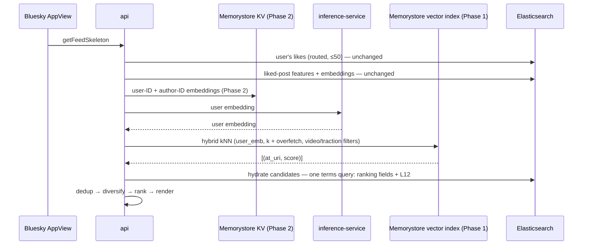
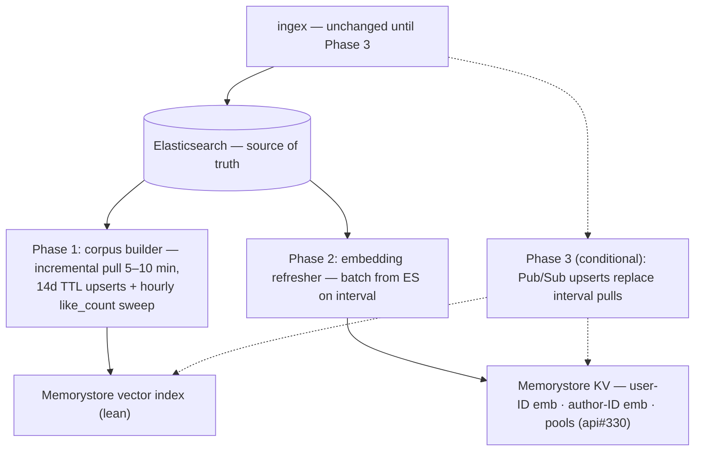
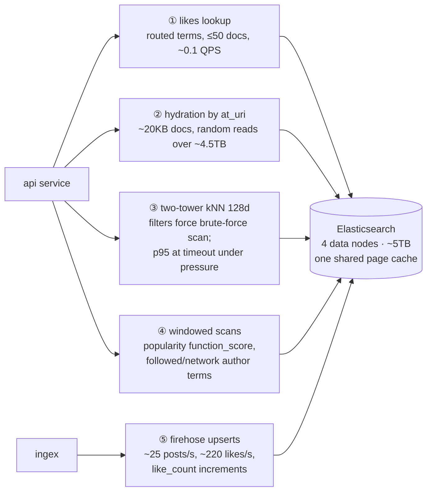
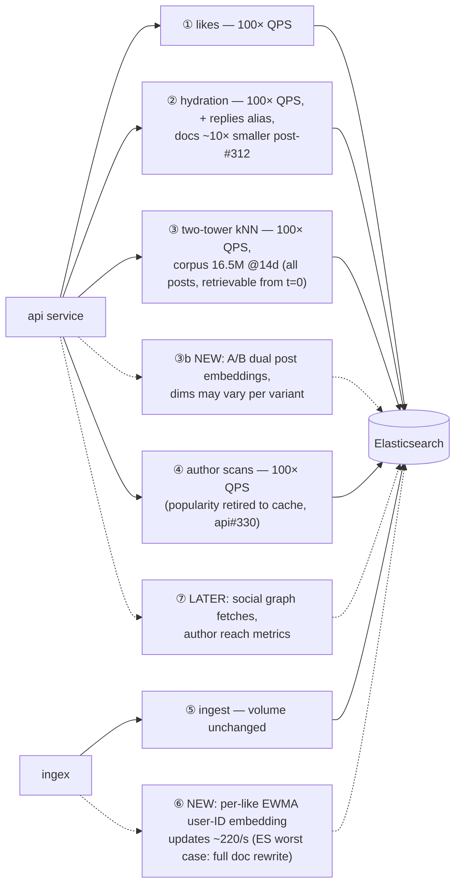

# Feeds Serving Datastore Redesign

**Status:** Proposal · 2026-08-03
**Scope:** Candidate generation and hydration datastores for feed serving. Ingest volume, ranking models, and ES's role as source of truth are unchanged.

---

## 1. Summary

Of the five workloads sharing our ES cluster, two-tower kNN is the one it serves badly today and per-like embedding updates are the one it will serve badly tomorrow (§2). The first fails in two distinct ways that load testing separates cleanly (§2.1):

- **Tail latency is a residency problem.** The two_tower vector working set is only as fast as its page-cache residency. The identical probe query costs **p50 1188ms** while background IO churns the cache and **p50 242ms** when it does not — a 4.9× spread on the same query. No other generator's p50 moves by more than a quarter, and the largest of those moves the wrong way. The 11% two_tower timeout rate is this spread's tail.
- **Throughput is a CPU problem.** At 605 renders/min all four ES data nodes sit at **84–99% CPU** with the search thread pool fully active and queue depth to 103, while api runs 10 instances at 44% CPU and disk reads stay flat. The cluster ceiling is data-node CPU spent on vector scans, not IO and not our own service.

Both follow from the same mechanism. A selective filter (`like_count>=20`, ~4.6% of the corpus) puts Lucene past its filtered-kNN work budget, so it abandons the HNSW graph and exact-scans every matching vector — ~320k vectors per query at the current 96h window cap. That scan is CPU-bound, and it is random-access across a page cache shared with ~4.5TB of documents and a continuous ingest write stream.

**Proposal:** move two-tower kNN to Memorystore for Redis vector search — a *lean index* of vectors and filter fields, with ES keeping all document truth and hydration — then exploit the store we're already running for roadmap features. Three phases, detailed in §5:

| Phase (§5) | Ships | Measurable outcome |
|---|---|---|
| **1** | Two-tower kNN off ES → lean Memorystore vector index | two_tower off the 4s timeout ceiling and off the residency cliff; ES data-node CPU at fixed QPS falls (§6.4) |
| **2** | Memorystore synergies: user-ID + author-ID embedding stores; home for popularity pools (api#330) | Unblocks the embedding roadmap at near-zero marginal infrastructure |
| **3** *(conditional)* | Pub/Sub streaming from ingex | When sub-minute freshness or per-like updates become requirements |

Every phase ships independently behind PostHog flags and degrades back to today's ES paths on failure. ingex is unchanged until Phase 3.

**What Phase 1 buys, stated precisely.** At the traction filter's ~4.7% selectivity Redis also exact-scans the filtered subset (`ADHOC_BF`, [E.4](#appendix-e-design-qa)) — the win is not a better algorithm, it is the same algorithm on a substrate that suits it:

| | ES today | Memorystore lean index |
|---|---|---|
| Regime at ~4.7% selectivity | exact scan (HNSW abandoned) | exact scan (`ADHOC_BF`) |
| Residency | page cache, shared with ~4.5TB of docs + ingest writes | RAM, by construction |
| Wasted work | failed HNSW traversal discarded, then rescan | none — policy chosen from index cardinality |
| Scan shape | scattered doc order, doc-values checks, float32 rescore | contiguous int8 SIMD sweep |
| Fan-out | 6 primary shards × N segments, each deciding independently | one index |
| Measured / expected | 100–350ms warm, ~30s cold, 11% timeouts | ~10ms, no cold case (§6.1 confirms) |

The scan itself is ~99MB of int8 for the full 14d traction-filtered corpus. ES spends 30–100× the memory-bandwidth floor on that work; Redis is expected to spend close to it. §6.1 is what turns "expected" into "measured" before any flip.

---

## 2. Workload characterization

Five workloads share one ES cluster. The homogeneity column identifies what churns a cache: heterogeneous reads continuously evict the homogeneous working sets that want residency — and 100× *user* growth multiplies only the heterogeneous rows. A complete materialized store (the Phase 1 index, §5) is immune to churn by construction; caches are not. Diagrams: [Appendix A](#appendix-a-workload-diagrams). Numbers measured on prod 2026-07-28/29, with the load-test ladder of 2026-07-31 (§2.1) confirming rows 3 and 4.

| # | Workload | Shape | Data touched (homogeneity) | Today → future | ES fit |
|---|---|---|---|---|---|
| 1 | User's likes | Point lookup (routed terms, ≤50) | Heterogeneous across users; stable per user | ~0.1 → ~12 QPS | Fine |
| 2 | Hydration by `at_uri` | KV multi-get | Liked posts: heterogeneous across users + 60d time tail — **the churn driver**. Candidates: overlapping, 14d-bounded | ~20KB docs → ~10× smaller post-#312; + replies; 100× QPS | Poor → OK |
| 3 | Two-tower kNN (128d) | Filtered vector ANN | Homogeneous — same corpus vectors every request; needs residency, evicted by row 2 | 109 runs/hr → 100×; corpus 16.5M @14d unfiltered; + A/B dual embeddings (post_similarity retired) | **Structurally bad** |
| 4 | Windowed scans / top-N | function_score; author terms | popularity: homogeneous per window; author scans: heterogeneous across users | popularity → cache (api#330); author scans stay | Mixed |
| 5 | Partial updates | Per-doc field updates | Scattered `like_count` increments today; **per-like EWMA user-ID embedding updates (~220/s) on roadmap** | + author reach metrics | **Worst case** (full doc rewrite per update) |

Rows 3 and 5 drive the design: one needs vectors and filters to cooperate, the other needs cheap updates. Neither is ES; both are the same store.

### 2.1 Load-test evidence

A five-step ladder on prod (2026-07-31, 30 → 300 qpm across 1 → 12 api instances) plus a post-storm repeat at 08:02 UTC. Client-side generation was labelled `load_test`; `probe` traffic ran throughout as an unchanging control.

**Residency drives the tail, and only for two_tower.** The probe query is byte-identical every time, so its cost is a pure residency measurement:

| generator (probe, idle) | competing IO (01:00–02:00 UTC) | quiet (07:00–11:00 UTC) | ratio |
|---|---|---|---|
| **two_tower** | p50 **1188** / p95 4531 | p50 **242** / p95 2254 | **4.9×** |
| followed_users | p50 245 / p95 688 | p50 242 / p95 484 | 1.0× |
| popularity | p50 413 / p95 712 | p50 521 / p95 750 | 0.8× |
| random_posts | p50 176 / p95 245 | p50 187 / p95 420 | 0.9× |

Row 3 is the only cache-sensitive workload in the system. This is a property of the access pattern, not of ES: a term or range query walks a compact posting list, while a filtered vector scan is scattered random access across gigabytes. Timeout rates over the same period track it — two_tower 11.0%, popularity 8.6%, followed_users 4.6%, random_posts 3.6% — and two_tower times out on organic traffic at ~6% even at idle.

**Throughput is bounded by ES data-node CPU.** At the 300 qpm step (605 successful renders/min, ~355 shard-level search QPS):

| signal | value |
|---|---|
| ES data-node CPU | **84–99%, all four nodes, sustained 5 min** |
| ES search thread pool | 13/13 active per node; queue depth to 103; **zero rejections** |
| ES mean query time | 3ms → **78ms** |
| ES device reads | 59 MB/s vs 42–52 MB/s idle — **flat** |
| api | 10 instances at **44% CPU p95** |
| inference-service | 1 instance throughout; heavy_ranker p50 243ms, perspective p50 232ms |

Two conclusions. First, a 40× increase in search load produced no meaningful increase in disk reads: the load-test working set was resident, and the marginal cost of query volume is **CPU burned on vector distance computations**. Second, the ceiling is the shared cluster, not our service — at 12 api instances the api tier was less than half utilised. Current 4-node capacity is roughly **600–700 renders/min**.

Below that ceiling the failure mode is different and unrelated: at ≤150 qpm, incidents trace to single-instance api saturation and autoscaler lag (the 02:30 burst ran on one instance at 60% CPU with ES data nodes at 20%). The two regimes need separating whenever a load test is read.

**Failure is queuing, not rejection.** Queue depth reached 103 with zero rejections — ES silently queues while the 4s generator timeout fires client-side, and ES continues executing abandoned queries to completion. Any fallback that returns this workload to ES under load reproduces this exactly; see §5.

Two caveats on this data. Sustained load *self-warms* the working set, so a matched-load comparison inside and outside the IO storm is near-identical (p50 523 vs 420ms) — load tests understate the residency problem that organic low-QPS traffic actually experiences. And attributing the 99% CPU figure between generators requires the per-`op` ES client/server timings from api#350; the generator mix was constant across every step, so this data cannot separate them.

---

## 3. Design goals

1. **Iterative and nimble** — each phase independently shippable and valuable.
2. **Latency over recall** for candidate generation ([why — E.2](#appendix-e-design-qa)).
3. **Every post retrievable from t=0** — traction preference via adjustable mechanisms, not membership walls.
4. **Parametric on scale** — 100× users, flat ingest; measured against the §2.1 ceiling of ~600–700 renders/min on the current cluster.
5. **Minimize new operational surface** — managed services; ingex untouched until Phase 3 (§5).
6. **Fail toward ES, not toward nothing.**

---

## 4. Key decisions

### 4.1 Corpus membership: all posts in window

Dropping `like_count>=20` from membership makes membership **static** (enter at creation, leave at TTL — upsert once, trivially correct) and makes every post retrievable from t=0 (new-post boosts, unknown-author exploration). Corpus grows 773k → 16.5M vectors @14d — still small (§4.2). Traction preference survives as a swappable mechanism ([E.1](#appendix-e-design-qa)):

- **(a) Query-time filtering** *(launch default — no model changes)*: server-side filtered kNN (§4.4);
- **(b) Ranking-pass shaping** — score adjustment in the heavy ranker;
- **(c) Two-tower modeling** — traction as a learned feature.

Mechanism choice and store choice are independent, but they interact, and the interaction is worth stating: **the selective traction filter is what puts Lucene into the exact-scan regime** (§4.4, [E.4](#appendix-e-design-qa)). Mechanisms (b) and (c) remove the filter from the query entirely, leaving only `created_at` (matches ~30–50% of the corpus) and `ge_post_embedding_model_uuid` (matches ~all of it outside a model rollout) — neither of which trips either Lucene fallback condition. On the Memorystore lean index the mechanism is a free choice, because `ADHOC_BF` handles (a) at ~10ms; on ES it is the difference between a graph search and a 320k-vector scan. (b) and (c) therefore remain the preferred end state independent of store, and are the reason (a) is a *launch default* rather than a design commitment.

This also opens an optional in-place substitute, described in [E.9](#appendix-e-design-qa): moving the traction filter out of the kNN pre-filter and applying it after retrieval with overfetch restores HNSW on ES today. It is not part of this proposal and not a prerequisite for it — it is an alternative worth considering if the Phase 1 timeline slips or if a cheap interim measurement of the residency thesis is wanted.

### 4.2 Algorithm: HNSW + scalar quantization, tuned for latency

Requirements: native streaming inserts (no retrain), p99 ≲10ms at 16.5M×128d, RAM-resident after quantization, recall ≥0.9, TTL-compatible deletes. **HNSW is the only family that meets them all** — inserts are native (insert = search + link), ~1–5ms, recall tunable down for speed; int8/fp16 quantization stacks under it at ≈zero recall cost. Full menu with mechanics and verdicts: [Appendix B](#appendix-b-ann-algorithm-menu).

**Quantization is a constant, not a differentiator.** `embeddings.ge_post_embedding` already resolves to `int8_hnsw` (`m: 16`, `ef_construction: 100`) — ES 9.0's default for an indexed float `dense_vector`, applied without the ingex template requesting it. Search footprint is ~268 B/vector (128 B quantized + 4 B correction + ~136 B graph), with the raw float32 retained alongside for rescoring. The same int8 scalar quantization is assumed on the Phase 1 index, so it appears on both sides of every comparison in §4.3 and explains none of the difference. It is documented here so the ~4–10GB sizing in §4.4 is traceable, not as a decision this design makes.

One consequence is actionable independently of this proposal: `embeddings.all_MiniLM_L12_v2` (384d) is mapped `index: true` and therefore carries a second int8_hnsw graph over the whole corpus at ~520 B/vector — roughly twice the footprint of the vector actually searched — while every read path retrieves it via `docvalue_fields` and nothing kNN-searches it since `post_similarity` was retired. `index: false` preserves retrieval and drops the graph, matching how `all_MiniLM_L6_v2` and `google_embeddinggemma_300m` are already mapped in the same template. Tracked separately; it reduces the cache pressure §2.1 measures but does not change the exact-scan regime.

### 4.3 Index home: Memorystore prototype-first; Qdrant as escalation

| | **(A) Memorystore Redis vector search (chosen)** | (B) In-process in inference-service | (C) Qdrant (self-hosted) | (D) Lean vector-only index on ES |
|---|---|---|---|---|
| ANN | HNSW; server-side hybrid pre-filters (tag/numeric) | Flat exact over filtered corpus | Filterable HNSW + named vectors — best-in-class | Same Lucene filtered kNN as today |
| Window expiry | **Native key TTL** | Own rebuild machinery | Cron delete-by-filter + vacuum | ILM, as today |
| KV consolidation | **Same store serves Phase 2 (§5)** | None | Covers vector-adjacent KV; list/set shapes still want a Redis | None |
| A/B embeddings | Separate vector fields/indexes | Two arrays | Named vectors per point | Extra mapped fields |
| Ops | Managed | None new; index duplicated per autoscaled instance at 100× | New self-hosted stateful service | None new |
| Precedent | GCP-managed RediSearch | Meta (FAISS), Spotify (Voyager) | X (Twitter) recommendation stack | — |

**(A)** collapses the ANN home and Phase 2 KV into one managed layer; gated by the bake-off (§6). **(B)** is struck down as likely throwaway work post-launch despite real prototyping merits ([E.3](#appendix-e-design-qa)). **(C)** is the escalation if Redis filtering or scale limits are hit; production-proven at X, at the cost of operating stateful infrastructure.

**(D)** deserves explicit treatment because §2.1 shows most of Phase 1's win is residency isolation, and a vectors-plus-filter-fields index — optionally pinned to its own nodes — delivers that without new infrastructure, scoring best on goal #5. It is rejected on three counts: the exact-scan regime and its CPU cost are unchanged (§4.4), so the §2.1 throughput ceiling moves only as far as the freed cache buys; it does nothing for row 5's partial-update problem, so Phase 2 would still need a second store; and dedicating nodes to it means provisioning for peak vector load in the same cluster that must also absorb ingest. It is the correct fallback if Memorystore fails the bake-off *and* Qdrant's operational cost is judged too high.

### 4.4 Lean index: contents, filtering, freshness

- **Contents (~4–10GB):** quantized vectors; `contains_video` (TAG); `created_at` via 14d key TTL; one **coarse `like_count` (NUMERIC), refreshed hourly** — stale values are fine for a filter, never used for ranking. Nothing mutable that anyone ranks on lives in Redis; a *hydrated* index returning document fields with hits was considered and rejected ([E.5](#appendix-e-design-qa)).
- **Filtering:** Redis hybrid queries pre-filter on tag/numeric indexes and run kNN over the induced subspace. At the traction filter's ~4.7% selectivity the engine brute-forces the 773k-vector subset — the fast exact-scan regime ([E.4](#appendix-e-design-qa)). Client-side overfetch survives only for `exclude_uris` (k + len(exclude), as today).

  For contrast, the same selectivity on ES trips both of Lucene's filtered-kNN fallbacks: segments where the filtered count ≤ `num_candidates` (currently `max(100, k·10)` = 300) bypass the graph outright, and on larger segments traversal exceeds a visit budget equal to the filter cardinality, discards its work, and rescans. `profile:true` on prod measured ~460k vector operations per query against ~928k matching documents (api#310) — the signature of exact scan, and the `vector_ops_count > 50k` symptom the repo's profiling runbook already documents. `TWO_TOWER_MAX_AGE_CAP_HOURS = 96` exists only to bound that scan to ~320k vectors, trading recall for scan size; Phase 1 retires the cap along with the regime, which is what unblocks api#324.

  One filter is a latent cliff worth carrying into the new index's design: `ge_post_embedding_model_uuid` matches essentially the whole corpus in steady state, but during a post-tower rollout the corpus splits by UUID and the matching set walks up from near-zero as re-embedding backfills. Below `num_candidates` the query returns thin or empty results rather than slow ones — a silent quality failure with no current per-generator signal. The Phase 1 index should either partition by model UUID or carry an explicit retrieved-count alarm.
- **Freshness:** one-time bootstrap pull; steady state is inserts only (~25 posts/s ≈ 15MB per 5-min cycle) plus the hourly `like_count` sweep (~2GB). New-post retrievability latency = pull interval. Pull-not-push rationale: [E.6](#appendix-e-design-qa).
- **Hydration:** kNN returns ids + scores; **one ES terms-by-`at_uri` query** (fields API) returns ranking fields + L12 embedding — ~27ms warm, and 14d-bounded reads are the cache-friendly kind (§2). Caching this in Memorystore was considered and rejected ([E.7](#appendix-e-design-qa)).

---

## 5. The phased plan

**Serving path — one your-feed load:**

**Background processes:**

### Phase 1 — two-tower kNN off ES

Ships the lean vector index and incremental builder (§4.4). two_tower queries Memorystore behind a PostHog flag: shadow mode first (log overlap@k and latency against ES kNN), then a per-generator flip, with the ES kNN path retained as a rate-limited emergency fallback. Removes the workload responsible for ES's cache-sensitive tail and its CPU ceiling (§2.1), and unblocks api#324 (window-cap removal) by retiring the 96h scan bound rather than tuning it.

### Phase 2 — exploit the store we now run

This phase exists purely to harvest synergy from Phase 1's store: the roadmap's per-like-updated user-ID embeddings are ES's worst workload (§2 row 5) and Redis's natural one, and the instance is already running. Ships user-ID and author-ID embedding stores (batch-refreshed from ES until Phase 3) and offers the natural home for api#330's popularity pools (that design stays with api#330; nothing here depends on it). Each feature flagged independently.

### Phase 3 — streaming from ingex (conditional, no date)

Pub/Sub upserts from ingex replace the interval pulls. Explicit triggers, not a schedule: per-like EWMA updates go live; a product need for sub-minute retrievability; or builder pulls measurably burden ES. Contract when triggered: versioned protobuf upserts/tombstones, at-least-once with idempotent writes, GCS snapshot + replay on boot. Until then, ingex is untouched.

**Failure behavior:** builder stall → serve last-good index, alert >30 min stale. Vector index down → ES kNN fallback behind the flag. KV down → embedding reads degrade gracefully (models tolerate the missing feature). ES down → same blast radius as today; no new failure mode.

The ES kNN fallback needs a bounded concurrency limit or circuit breaker, not a bare flag flip. §2.1 shows this workload saturates all four data nodes at 605 renders/min while ES queues rather than rejects — a fallback that returns full traffic to the retired path at any real load reproduces that saturation, and takes the other four generators down with it, because the contention is cluster-wide CPU. Degrading two_tower to empty (the existing `not_run` path) is preferable to degrading every feed.

---

## 6. Validation plan and open questions

1. **Bake-off spike (§4.3 A vs C):** load the real 16.5M×128d corpus into Memorystore and Qdrant; measure p50/p99 at target QPS, recall@100 vs exact, memory, insert throughput, TTL behavior, and hybrid-filter latency/policy at our real selectivities (traction ~4.7%, video); confirm Memorystore parity with OSS Redis hybrid queries. Produces the doc's final numbers, and specifically confirms or refutes the ~10ms `ADHOC_BF` expectation in §1 — the single number the proposal rests on.
2. **Load-test ladder:** complete, §2.1. Establishes the ~600–700 renders/min ceiling and identifies data-node CPU as the binding constraint. Re-run post-flip against the same steps.
3. **Post-recovery measurement pass:** re-baseline generator latencies post-#312; corpus counts; builder bootstrap and steady-state timing.
4. **Shadow criteria before flip:** overlap@k consistent with the recall target; two_tower p95 in budget; no increase in degraded renders; **ES data-node CPU and search thread-pool queue depth at fixed QPS**, which are the signals that actually moved in §2.1 and which a latency-only criterion misses.

**Prerequisites for evaluating those criteria.** Two instrumentation gaps sit between this design and its own acceptance test:

- Per-`op` ES client-side and server-side timings (api#350) are required to attribute the §2.1 CPU figure between generators, and therefore to state what Phase 1 frees rather than infer it.
- `feed.render.duration_ms` and `candidates.generate.duration_ms` use OTel default histogram buckets, whose boundaries above 1s are 1000 / 2500 / 5000 / 7500 / 10000. Every p95/p99 in the 1–5s range is interpolation inside a single 2.5s-wide bucket, so "two_tower p95 in budget" is not currently measurable at the resolution the criterion implies. Explicit boundaries in the 1–5s range are a prerequisite for criterion 4.

**Open:** final traction mechanism (§4.1 beyond the launch default); whether author scans (§2 row 4) stay viable on ES at 100×.

---

## Appendix A — Workload diagrams

**A1. Current: five workloads, one cluster.**

**A2. Future workload pattern (deltas dashed).**

A2 is drawn against ES to show what the cluster would absorb *without* this proposal; the design moves ③/③b/⑥ onto Memorystore and keeps ①/②/④ on ES.

## Appendix B — ANN algorithm menu

Requirements (§4.2): native streaming inserts, p99 ≲10ms @16.5M×128d, RAM-resident after quantization, recall ≥0.9, TTL-compatible deletes.

| Algorithm | Mechanics | Meets requirements? | Notes |
|---|---|---|---|
| Flat (brute force) | SIMD dot-product against every vector; no index structure | ✗ — ~200–500ms @16.5M | Exact and simplest at small scale (~10–30ms @773k, bandwidth-bound: 99MB of int8). Sequential access, so it degrades far more gracefully than HNSW under a cold cache. **This is the regime we are already in on ES** (§4.4) and the one Redis chooses deliberately at our selectivity |
| IVF | k-means partitions; query probes nearest cells | ✗ — periodic retrain conflicts with streaming inserts | Recall drifts under churn |
| **HNSW (chosen)** | Multi-layer proximity graph; greedy coarse→fine descent, O(log n) | **✓** — inserts native, ~1–5ms, 0.95–0.99 recall | The industry default; deletes tombstone + vacuum. Search is pointer-chasing — every hop is a random access with no prefetch, which is why it is the most residency-sensitive structure here (§2.1) and why the index must be RAM-resident rather than page-cache-resident |
| Filterable HNSW (Qdrant) | Extra payload-aware edges keep the graph connected under filters | **✓** | Best-in-class filtered ANN; relevant to §4.3 option C |
| **SQ int8/fp16 (stacked; already in use)** | Scalar-quantize each dimension | **✓** — companion, not standalone | ~4× memory reduction at ≈zero recall cost. Already active on ES via `int8_hnsw` (§4.2) and assumed on the Phase 1 index — present on both sides, so it differentiates nothing |
| PQ | Subvector codebooks; distance via lookup tables | ✗ — recall cost + rerank solve a ≥100M problem we don't have | 8–32× smaller |
| Binary / RaBitQ | 1 bit/dim + exact rerank of a shortlist | ✓ — but unnecessary at 16.5M | Large-scale favorite (ES "BBQ", Qdrant BQ) |
| ScaNN | Anisotropic quantization optimized for inner-product ranking | ✗ — codebook training conflicts with streaming inserts | Best CPU benchmarks; powers Vertex AI |
| DiskANN / Vamana | Flat graph traversed from SSD | ✗ — solves a RAM constraint we don't have | Billion-scale corpora |

## Appendix C — Market scan

- **X (Twitter):** Qdrant in the recommendation stack — strongest precedent for §4.3 option C at social-media scale.
- **Meta:** embedding retrieval from precomputed FAISS indices inside the search backend.
- **Pinterest:** in-house distributed ANN behind two-tower retrieval (alongside generative retrieval, PinRec).
- **Spotify:** Voyager, an in-process HNSW library replacing Annoy.
- **Pattern:** nobody at our workload shape runs a standalone vector-database cluster; the choice is embedded indices vs a vector-capable store already in the stack. Standalone vector DBs target RAG products.

## Appendix D — Measurement methodology

- Corpus counts: `_count` with `created_at`/`like_count` filters against `posts_recent` (2026-07-29).
- Query rates & latencies: Cloud Monitoring PromQL over `custom.googleapis.com/greenearth-api/*`, `namespace="prod"`.
- Storage anatomy: `_disk_usage?run_expensive_tasks=true` on `posts-2026-w31`; `_cat/indices`, `_cat/nodes`, `_nodes/stats`.
- Warm/cold spread and brute-force scan evidence: #310 investigation (query replay with `profile:true`).
- Load-test ladder (§2.1): prod, 2026-07-31, five steps 02:27–03:50 UTC plus a post-storm repeat at 08:02 UTC; client-side generation per #189 with the `traffic` label separating `load_test` / `probe` / `real`. Server-side series from `custom.googleapis.com/greenearth-api/*` (`ALIGN_DELTA` + `REDUCE_PERCENTILE_*`; the percentile aligners do not apply to cumulative distributions), Cloud Run `run.googleapis.com/container/*`, and the ES Prometheus exporter (`elasticsearch_os_cpu_percent`, `elasticsearch_thread_pool_{active,queue,rejected}_count{type="search"}`, `elasticsearch_indices_search_query_{total,time_seconds}`, `elasticsearch_filesystem_io_stats_device_read_size_kilobytes_sum`).
- Competing-IO windows: the recurring cold-read storm runs ~00:00–05:30 UTC at 44–65 MB/s sustained, against 0.5–5 MB/s outside it. All six load-test steps fall inside it; the §2.1 probe comparison uses 07:00–11:00 UTC as the quiet control.
- Index mapping and resolved `index_options`: `_mapping/field/...?include_defaults=true` against ES 9.0.0, the version pinned in `ingex/index/deploy/k8s/base/elasticsearch.yaml`.
- Memory/GC: `_nodes/stats` JVM/OS (2026-07-28, pre-recovery — refresh pending).
- Sources: [Redis vector search & hybrid policies](https://redis.io/docs/latest/develop/ai/search-and-query/vectors/) · [Memorystore hybrid query syntax](https://docs.cloud.google.com/memorystore/docs/cluster/query-syntax) · [Memorystore vector search](https://docs.cloud.google.com/memorystore/docs/redis/about-vector-search) · [Qdrant filterable HNSW](https://qdrant.tech/course/essentials/day-2/filterable-hnsw/) · [X/Qdrant](https://www.linkedin.com/posts/stefanweber1_x-twitter-is-now-powered-by-qdrant-vector-activity-7126255589713739776-Ncsx) · [Meta/FAISS](https://engineering.fb.com/2026/04/21/ml-applications/modernizing-the-facebook-groups-search-to-unlock-the-power-of-community-knowledge/) · [Pinterest learned retrieval](https://medium.com/pinterest-engineering/establishing-a-large-scale-learned-retrieval-system-at-pinterest-eb0eaf7b92c5) · [Voyager](https://zilliz.com/learn/what-is-voyager) · [Big ANN benchmarks](https://arxiv.org/pdf/2409.17424)

## Appendix E — Design Q&A

Questions raised during review, kept here for reference.

**E.1 — Doesn't dropping `like_count>=20` hurt candidate quality?** The preference is preserved, just moved to an adjustable layer: query-time filter (launch default, behaviorally near-identical to today), ranking-side shaping, or a learned model feature. As a membership rule it was also a product wall — posts under 20 likes were *unretrievable*, blocking new-post boosts and unknown-author exploration no ranking tweak could undo.

**E.2 — Why prioritize latency over recall?** Candidates feed a ranker; a recall miss swaps in a near-equivalent neighbor the ranker treats interchangeably, so recall ~0.9 is invisible in product terms. Latency is directly user-visible. Recall matters most where the retrieved item *is* the answer (search, RAG); we are two stages upstream of that.

**E.3 — Why not FAISS/numpy in-process in the inference service?** Real merits: feature parity with today's known-working patterns and the fastest prototype (no services to enable). But it duplicates an ~8GB index per autoscaled instance at 100×, we'd own the build/swap/vacuum machinery, and A/B variants and server-side filters would be hand-rolled — likely throwaway work post-launch. Meta and Spotify run embedded indices, but with dedicated serving fleets we don't want to build.

**E.4 — Does Redis actually support filtered kNN? What about overfetch?** Yes: hybrid queries pre-filter on tag/numeric indexes, then run kNN over the induced subspace — brute-force over the filtered subset (ADHOC_BF) when the filter is selective, HNSW traversal with filter intersection (BATCHES) when broad. Our traction filter (~4.7% → 773k vectors) lands in the brute-force regime — the fast exact-scan case in [Appendix B](#appendix-b-ann-algorithm-menu), ~99MB of int8 swept contiguously. Note this is the same *regime* ES is already in (§4.4); the difference is that Redis selects it up front from index cardinality and scans a resident contiguous array, where Lucene arrives at it by exhausting a graph traversal it then discards. The overfetch problem therefore never materializes; only `exclude_uris` uses bounded overfetch (k + len(exclude)), as the code does today.

**E.5 — Why not a "hydrated" index that returns document fields with kNN hits?** Size is the visible cost (~25–30GB vs 4–10GB lean) but freshness is the killer: `like_count` is ranking input and mutates ~220×/s across the whole corpus. Keeping it ranking-fresh in Redis means either full-corpus sweeps (~21GB per cycle) or building the Phase 3 streaming contract early. The lean index stores nothing mutable that anyone ranks on; fresh values come from the single ES hydration query (~27ms warm).

**E.6 — Why does the builder pull from ES instead of ingex pushing?** ES is already the materialized view of the firehose, and static membership (§4.1) reduces sync to "upsert new posts + TTL" — ~15MB per 5-minute cycle. A push contract would couple ingex availability to the index service and require schema/ordering/replay machinery before any requirement demands it. Those requirements have names (per-like updates, sub-minute freshness) and are exactly the Phase 3 triggers.

**E.7 — Why not cache hydration reads in Memorystore?** A demand-filled cache holds the popular documents — the same ones ES's own page cache already serves cheaply; the expensive cold-tail reads (a diverse user's old liked posts) miss *both* caches. Hit rate on the 60d/140M-post liked universe is speculative, the p50 win is ~25ms per call in a 1–2s render, and caching introduces `like_count` staleness into a ranking input. Post-#312 (docs ~10× smaller), ES point lookups are its strength. User/author-ID embeddings are different: they are *new data with no other home*, not a cache — which is why they are Phase 2 and hydration caching is not.

**E.8 — Is ES going away?** No. It remains source of truth, and keeps the workloads it fits: routed likes lookups, author scans, and hydration. This design removes only the two workloads it is structurally wrong for — filtered vector search and high-frequency partial updates (§2 rows 3 and 5).

**E.9 — If the traction filter is what breaks HNSW, could we just stop pre-filtering on it and stay on ES?** Possibly, and it is worth stating as an explicit alternative rather than leaving it implicit in §4.1's mechanism menu. Passing `min_like_count` outside the kNN clause and applying it after retrieval with overfetch leaves the graph search intact: at a ~4.6% base rate, `k≈1000` yields ~30 survivors, and `num_candidates` would need decoupling from the `max(100, k·10)` heuristic in `es_candidates.py` (`k=1000, num_candidates=2000` is roughly 12–25k distance computations across six shards, versus ~320k vectors scanned today). Overfetch-then-filter is already the established pattern for `popularity`, `random_posts`, and `followed_users` (api#310). Expect ~6–10× warm, and a materially shorter cold tail because the query touches thousands of vectors instead of hundreds of thousands.

It is an *alternative* to moving retrieval to Memorystore now, on the same footing as mechanisms (b) and (c) in §4.1 — not a step within this plan, and not something this proposal recommends doing first. What it buys is optionality: it is roughly a day of work behind a flag, needs no new infrastructure and no retraining, and would give a direct in-place measurement of how much of §2.1's cost is the exact-scan regime versus cache contention.

What it does not do is remove the reasons for Phase 1. It leaves vector serving on a page cache shared with ~4.5TB of documents and a continuous write stream; it does nothing for §2 row 5, which is the harder half of the case; and pre-filtering and post-filtering return genuinely different result sets — *the nearest posts that are popular* versus *the popular posts among the nearest* — so it carries a candidate-quality risk that mechanisms (b) and (c) do not, and would need the same shadow comparison (overlap@k, downstream engagement) as any retrieval change. [E.2](#appendix-e-design-qa) argues that risk is small; it is not zero, and it is a product decision rather than an engineering one.
