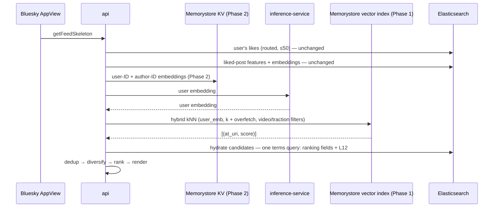
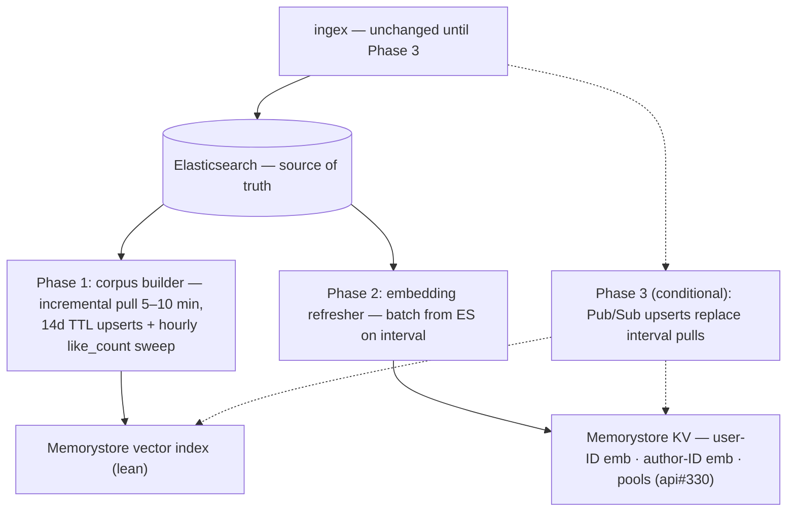
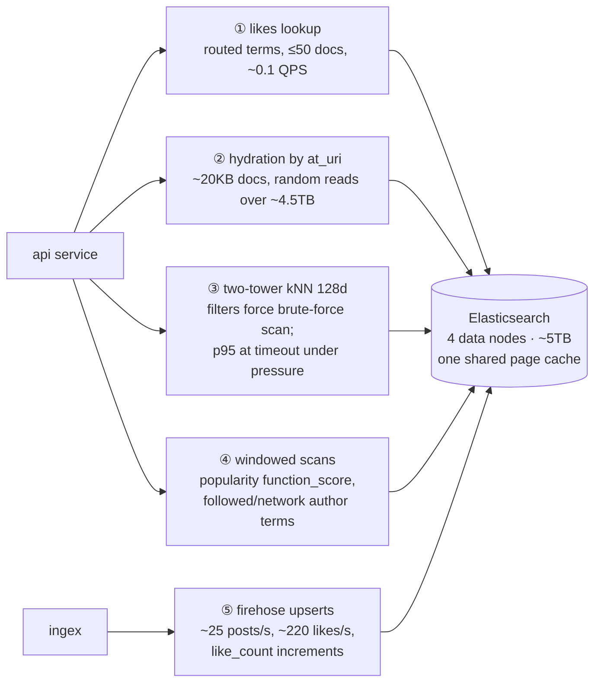
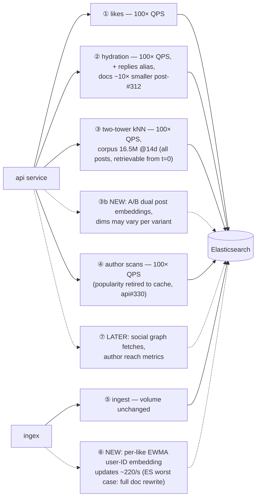

# Feeds Serving Datastore Redesign

**Status:** Draft for review · 2026-07-30
**Scope:** Candidate generation and hydration datastores for feed serving. Ingest volume, ranking models, and ES's role as source of truth are unchanged.

---

## 1. Summary

Feed serving cost on Elasticsearch is dominated by page-cache residency — the same query runs 26ms warm and 30s cold — and our worst query (two-tower kNN) is structurally hostile to ES: its filters force Lucene out of HNSW into brute-force vector scans. Capacity work (#312) buys headroom, but roadmap features (per-like embedding updates, A/B post embeddings, 100× user scale) make the gap permanent.

**Proposal:** move two-tower kNN to Memorystore for Redis vector search — a *lean index* of vectors and filter fields, with ES keeping all document truth and hydration — then exploit the store we're already running for roadmap features. Three phases, detailed in §5:

| Phase (§5) | Ships | Measurable outcome |
|---|---|---|
| **1** | Two-tower kNN off ES → lean Memorystore vector index | Eliminates the dominant ES query; two_tower p95 off the timeout ceiling |
| **2** | Memorystore synergies: user-ID + author-ID embedding stores; home for popularity pools (api#330) | Unblocks the embedding roadmap at near-zero marginal infrastructure |
| **3** *(conditional)* | Pub/Sub streaming from ingex | Only if sub-minute freshness or per-like updates become requirements |

Every phase ships independently behind PostHog flags and degrades back to today's ES paths on failure. ingex is unchanged until Phase 3.

---

## 2. Workload characterization

Five workloads share one ES cluster. The homogeneity column identifies what churns a cache: heterogeneous reads continuously evict the homogeneous working sets that want residency — and 100× *user* growth multiplies only the heterogeneous rows. A complete materialized store (the Phase 1 index, §5) is immune to churn by construction; caches are not. Diagrams: [Appendix A](#appendix-a-workload-diagrams). Numbers measured on prod 2026-07-28/29 (provisional until load tests).

| # | Workload | Shape | Data touched (homogeneity) | Today → future | ES fit |
|---|---|---|---|---|---|
| 1 | User's likes | Point lookup (routed terms, ≤50) | Heterogeneous across users; stable per user | ~0.1 → ~12 QPS | Fine |
| 2 | Hydration by `at_uri` | KV multi-get | Liked posts: heterogeneous across users + 60d time tail — **the churn driver**. Candidates: overlapping, 14d-bounded | ~20KB docs → ~10× smaller post-#312; + replies; 100× QPS | Poor → OK |
| 3 | Two-tower kNN (128d) | Filtered vector ANN | Homogeneous — same corpus vectors every request; needs residency, evicted by row 2 | 109 runs/hr → 100×; corpus 16.5M @14d unfiltered; + A/B dual embeddings (post_similarity retired) | **Structurally bad** |
| 4 | Windowed scans / top-N | function_score; author terms | popularity: homogeneous per window; author scans: heterogeneous across users | popularity → cache (api#330); author scans stay | Mixed |
| 5 | Partial updates | Per-doc field updates | Scattered `like_count` increments today; **per-like EWMA user-ID embedding updates (~220/s) on roadmap** | + author reach metrics | **Worst case** (full doc rewrite per update) |

Rows 3 and 5 drive the design: one needs vectors and filters to cooperate, the other needs cheap updates. Neither is ES; both are the same store.

---

## 3. Design goals

1. **Iterative and nimble** — each phase independently shippable and valuable.
2. **Latency over recall** for candidate generation ([why — E.2](#appendix-e-design-qa)).
3. **Every post retrievable from t=0** — traction preference via adjustable mechanisms, not membership walls.
4. **Parametric on scale** — 100× users, flat ingest; resource claims provisional until load tests.
5. **Minimize new operational surface** — managed services; ingex untouched until Phase 3 (§5).
6. **Fail toward ES, not toward nothing.**

---

## 4. Key decisions

### 4.1 Corpus membership: all posts in window

Dropping `like_count>=20` from membership makes membership **static** (enter at creation, leave at TTL — upsert once, trivially correct) and makes every post retrievable from t=0 (new-post boosts, unknown-author exploration). Corpus grows 773k → 16.5M vectors @14d — still small (§4.2). Traction preference survives as a swappable mechanism ([E.1](#appendix-e-design-qa)):

- **(a) Query-time filtering** *(launch default — no model changes)*: server-side filtered kNN (§4.4);
- **(b) Ranking-pass shaping** — score adjustment in the heavy ranker;
- **(c) Two-tower modeling** — traction as a learned feature.

### 4.2 Algorithm: HNSW + scalar quantization, tuned for latency

Requirements: native streaming inserts (no retrain), p99 ≲10ms at 16.5M×128d, RAM-resident after quantization, recall ≥0.9, TTL-compatible deletes. **HNSW is the only family that meets them all** — inserts are native (insert = search + link), ~1–5ms, recall tunable down for speed; int8/fp16 quantization stacks under it at ≈zero recall cost. Full menu with mechanics and verdicts: [Appendix B](#appendix-b-ann-algorithm-menu).

### 4.3 Index home: Memorystore prototype-first; Qdrant as escalation

| | **(A) Memorystore Redis vector search (chosen)** | (B) In-process in inference-service | (C) Qdrant (self-hosted) |
|---|---|---|---|
| ANN | HNSW; server-side hybrid pre-filters (tag/numeric) | Flat exact over filtered corpus | Filterable HNSW + named vectors — best-in-class |
| Window expiry | **Native key TTL** | Own rebuild machinery | Cron delete-by-filter + vacuum |
| KV consolidation | **Same store serves Phase 2 (§5)** | None | Covers vector-adjacent KV; list/set shapes still want a Redis |
| A/B embeddings | Separate vector fields/indexes | Two arrays | Named vectors per point |
| Ops | Managed | None new; index duplicated per autoscaled instance at 100× | New self-hosted stateful service |
| Precedent | GCP-managed RediSearch | Meta (FAISS), Spotify (Voyager) | X (Twitter) recommendation stack |

**(A)** collapses the ANN home and Phase 2 KV into one managed layer; gated by the bake-off (§6). **(B)** is struck down as likely throwaway work post-launch despite real prototyping merits ([E.3](#appendix-e-design-qa)). **(C)** is the escalation if Redis filtering or scale limits are hit; production-proven at X, at the cost of operating stateful infrastructure.

### 4.4 Lean index: contents, filtering, freshness

- **Contents (~4–10GB):** quantized vectors; `contains_video` (TAG); `created_at` via 14d key TTL; one **coarse `like_count` (NUMERIC), refreshed hourly** — stale values are fine for a filter, never used for ranking. Nothing mutable that anyone ranks on lives in Redis; a *hydrated* index returning document fields with hits was considered and rejected ([E.5](#appendix-e-design-qa)).
- **Filtering:** Redis hybrid queries pre-filter on tag/numeric indexes and run kNN over the induced subspace. At the traction filter's ~4.7% selectivity the engine brute-forces the 773k-vector subset — the fast exact-scan regime ([E.4](#appendix-e-design-qa)). Client-side overfetch survives only for `exclude_uris` (k + len(exclude), as today).
- **Freshness:** one-time bootstrap pull; steady state is inserts only (~25 posts/s ≈ 15MB per 5-min cycle) plus the hourly `like_count` sweep (~2GB). New-post retrievability latency = pull interval. Pull-not-push rationale: [E.6](#appendix-e-design-qa).
- **Hydration:** kNN returns ids + scores; **one ES terms-by-`at_uri` query** (fields API) returns ranking fields + L12 embedding — ~27ms warm, and 14d-bounded reads are the cache-friendly kind (§2). Caching this in Memorystore was considered and rejected ([E.7](#appendix-e-design-qa)).

---

## 5. The phased plan

**Serving path — one your-feed load:**

**Background processes:**

### Phase 1 — two-tower kNN off ES

Ships the lean vector index and incremental builder (§4.4). two_tower queries Memorystore behind a PostHog flag: shadow mode first (log overlap@k and latency against ES kNN), then a per-generator flip, with the ES kNN path retained as emergency fallback. Removes ES's dominant query and unblocks api#324 (window-cap removal).

### Phase 2 — exploit the store we now run

This phase exists purely to harvest synergy from Phase 1's store: the roadmap's per-like-updated user-ID embeddings are ES's worst workload (§2 row 5) and Redis's natural one, and the instance is already running. Ships user-ID and author-ID embedding stores (batch-refreshed from ES until Phase 3) and offers the natural home for api#330's popularity pools (that design stays with api#330; nothing here depends on it). Each feature flagged independently.

### Phase 3 — streaming from ingex (conditional, no date)

Pub/Sub upserts from ingex replace the interval pulls. Explicit triggers, not a schedule: per-like EWMA updates go live; a product need for sub-minute retrievability; or builder pulls measurably burden ES. Contract when triggered: versioned protobuf upserts/tombstones, at-least-once with idempotent writes, GCS snapshot + replay on boot. Until then, ingex is untouched.

**Failure behavior:** builder stall → serve last-good index, alert >30 min stale. Vector index down → ES kNN fallback behind the flag. KV down → embedding reads degrade gracefully (models tolerate the missing feature). ES down → same blast radius as today; no new failure mode.

---

## 6. Validation plan and open questions

1. **Bake-off spike (§4.3 A vs C):** load the real 16.5M×128d corpus into Memorystore and Qdrant; measure p50/p99 at target QPS, recall@100 vs exact, memory, insert throughput, TTL behavior, and hybrid-filter latency/policy at our real selectivities (traction ~4.7%, video); confirm Memorystore parity with OSS Redis hybrid queries. Produces the doc's final numbers.
2. **100× load tests** (owned separately): may re-rank §4.3 and refresh §2.
3. **Post-recovery measurement pass:** re-baseline generator latencies post-#312; corpus counts; builder bootstrap and steady-state timing.
4. **Shadow criteria before flip:** overlap@k consistent with the recall target; two_tower p95 in budget; no increase in degraded renders.

**Open:** final traction mechanism (§4.1 beyond the launch default); whether author scans (§2 row 4) stay viable on ES at 100×.

---

## Appendix A — Workload diagrams

**A1. Current: five workloads, one cluster.**

**A2. Future workload pattern (deltas dashed).**

A2 is drawn against ES to show what the cluster would absorb *without* this proposal; the design moves ③/③b/⑥ onto Memorystore and keeps ①/②/④ on ES.

## Appendix B — ANN algorithm menu

Requirements (§4.2): native streaming inserts, p99 ≲10ms @16.5M×128d, RAM-resident after quantization, recall ≥0.9, TTL-compatible deletes.

| Algorithm | Mechanics | Meets requirements? | Notes |
|---|---|---|---|
| Flat (brute force) | SIMD dot-product against every vector; no index structure | ✗ — ~200–500ms @16.5M | Exact and simplest at small scale (~10–30ms @773k); reappears usefully as Redis's ADHOC_BF regime for selective filters |
| IVF | k-means partitions; query probes nearest cells | ✗ — periodic retrain conflicts with streaming inserts | Recall drifts under churn |
| **HNSW (chosen)** | Multi-layer proximity graph; greedy coarse→fine descent, O(log n) | **✓** — inserts native, ~1–5ms, 0.95–0.99 recall | The industry default; deletes tombstone + vacuum |
| Filterable HNSW (Qdrant) | Extra payload-aware edges keep the graph connected under filters | **✓** | Best-in-class filtered ANN; relevant to §4.3 option C |
| **SQ int8/fp16 (chosen, stacked)** | Scalar-quantize each dimension | **✓** — companion, not standalone | 2–4× memory reduction at ≈zero recall cost |
| PQ | Subvector codebooks; distance via lookup tables | ✗ — recall cost + rerank solve a ≥100M problem we don't have | 8–32× smaller |
| Binary / RaBitQ | 1 bit/dim + exact rerank of a shortlist | ✓ — but unnecessary at 16.5M | Large-scale favorite (ES "BBQ", Qdrant BQ) |
| ScaNN | Anisotropic quantization optimized for inner-product ranking | ✗ — codebook training conflicts with streaming inserts | Best CPU benchmarks; powers Vertex AI |
| DiskANN / Vamana | Flat graph traversed from SSD | ✗ — solves a RAM constraint we don't have | Billion-scale corpora |

## Appendix C — Market scan

- **X (Twitter):** Qdrant in the recommendation stack — strongest precedent for §4.3 option C at social-media scale.
- **Meta:** embedding retrieval from precomputed FAISS indices inside the search backend.
- **Pinterest:** in-house distributed ANN behind two-tower retrieval (alongside generative retrieval, PinRec).
- **Spotify:** Voyager, an in-process HNSW library replacing Annoy.
- **Pattern:** nobody at our workload shape runs a standalone vector-database cluster; the choice is embedded indices vs a vector-capable store already in the stack. Standalone vector DBs target RAG products.

## Appendix D — Measurement methodology

- Corpus counts: `_count` with `created_at`/`like_count` filters against `posts_recent` (2026-07-29).
- Query rates & latencies: Cloud Monitoring PromQL over `custom.googleapis.com/greenearth-api/*`, `namespace="prod"`.
- Storage anatomy: `_disk_usage?run_expensive_tasks=true` on `posts-2026-w31`; `_cat/indices`, `_cat/nodes`, `_nodes/stats`.
- Warm/cold spread and brute-force scan evidence: #310 investigation (query replay with `profile:true`).
- Memory/GC: `_nodes/stats` JVM/OS (2026-07-28, pre-recovery — refresh pending).
- Sources: [Redis vector search & hybrid policies](https://redis.io/docs/latest/develop/ai/search-and-query/vectors/) · [Memorystore hybrid query syntax](https://docs.cloud.google.com/memorystore/docs/cluster/query-syntax) · [Memorystore vector search](https://docs.cloud.google.com/memorystore/docs/redis/about-vector-search) · [Qdrant filterable HNSW](https://qdrant.tech/course/essentials/day-2/filterable-hnsw/) · [X/Qdrant](https://www.linkedin.com/posts/stefanweber1_x-twitter-is-now-powered-by-qdrant-vector-activity-7126255589713739776-Ncsx) · [Meta/FAISS](https://engineering.fb.com/2026/04/21/ml-applications/modernizing-the-facebook-groups-search-to-unlock-the-power-of-community-knowledge/) · [Pinterest learned retrieval](https://medium.com/pinterest-engineering/establishing-a-large-scale-learned-retrieval-system-at-pinterest-eb0eaf7b92c5) · [Voyager](https://zilliz.com/learn/what-is-voyager) · [Big ANN benchmarks](https://arxiv.org/pdf/2409.17424)

## Appendix E — Design Q&A

Questions raised during review, kept here for reference.

**E.1 — Doesn't dropping `like_count>=20` hurt candidate quality?** The preference is preserved, just moved to an adjustable layer: query-time filter (launch default, behaviorally near-identical to today), ranking-side shaping, or a learned model feature. As a membership rule it was also a product wall — posts under 20 likes were *unretrievable*, blocking new-post boosts and unknown-author exploration no ranking tweak could undo.

**E.2 — Why prioritize latency over recall?** Candidates feed a ranker; a recall miss swaps in a near-equivalent neighbor the ranker treats interchangeably, so recall ~0.9 is invisible in product terms. Latency is directly user-visible. Recall matters most where the retrieved item *is* the answer (search, RAG); we are two stages upstream of that.

**E.3 — Why not FAISS/numpy in-process in the inference service?** Real merits: feature parity with today's known-working patterns and the fastest prototype (no services to enable). But it duplicates an ~8GB index per autoscaled instance at 100×, we'd own the build/swap/vacuum machinery, and A/B variants and server-side filters would be hand-rolled — likely throwaway work post-launch. Meta and Spotify run embedded indices, but with dedicated serving fleets we don't want to build.

**E.4 — Does Redis actually support filtered kNN? What about overfetch?** Yes: hybrid queries pre-filter on tag/numeric indexes, then run kNN over the induced subspace — brute-force over the filtered subset (ADHOC_BF) when the filter is selective, HNSW traversal with filter intersection (BATCHES) when broad. Our traction filter (~4.7% → 773k vectors) lands in the brute-force regime, which is the same exact-scan-over-small-corpus case measured fast earlier in this design. The overfetch problem therefore never materializes; only `exclude_uris` uses bounded overfetch (k + len(exclude)), as the code does today.

**E.5 — Why not a "hydrated" index that returns document fields with kNN hits?** Size is the visible cost (~25–30GB vs 4–10GB lean) but freshness is the killer: `like_count` is ranking input and mutates ~220×/s across the whole corpus. Keeping it ranking-fresh in Redis means either full-corpus sweeps (~21GB per cycle) or building the Phase 3 streaming contract early. The lean index stores nothing mutable that anyone ranks on; fresh values come from the single ES hydration query (~27ms warm).

**E.6 — Why does the builder pull from ES instead of ingex pushing?** ES is already the materialized view of the firehose, and static membership (§4.1) reduces sync to "upsert new posts + TTL" — ~15MB per 5-minute cycle. A push contract would couple ingex availability to the index service and require schema/ordering/replay machinery before any requirement demands it. Those requirements have names (per-like updates, sub-minute freshness) and are exactly the Phase 3 triggers.

**E.7 — Why not cache hydration reads in Memorystore?** A demand-filled cache holds the popular documents — the same ones ES's own page cache already serves cheaply; the expensive cold-tail reads (a diverse user's old liked posts) miss *both* caches. Hit rate on the 60d/140M-post liked universe is speculative, the p50 win is ~25ms per call in a 1–2s render, and caching introduces `like_count` staleness into a ranking input. Post-#312 (docs ~10× smaller), ES point lookups are its strength. User/author-ID embeddings are different: they are *new data with no other home*, not a cache — which is why they are Phase 2 and hydration caching is not.

**E.8 — Is ES going away?** No. It remains source of truth, and keeps the workloads it fits: routed likes lookups, author scans, and hydration. This design removes only the two workloads it is structurally wrong for — filtered vector search and high-frequency partial updates (§2 rows 3 and 5).
