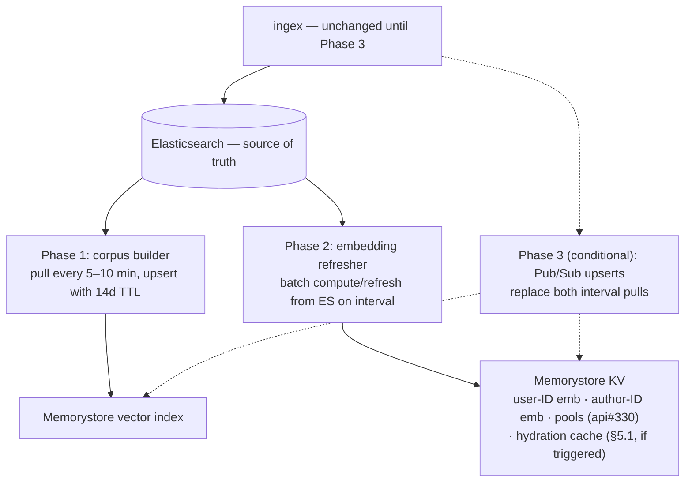
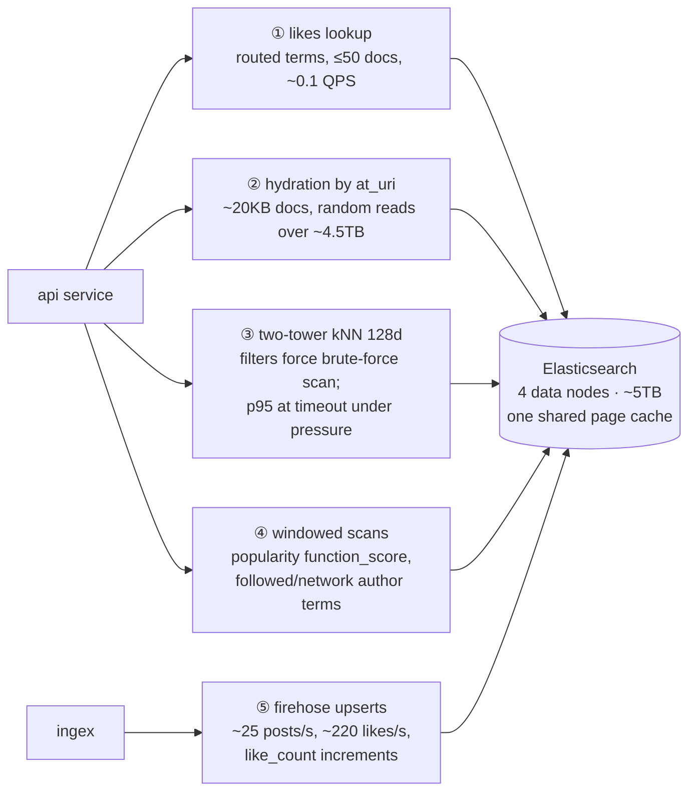
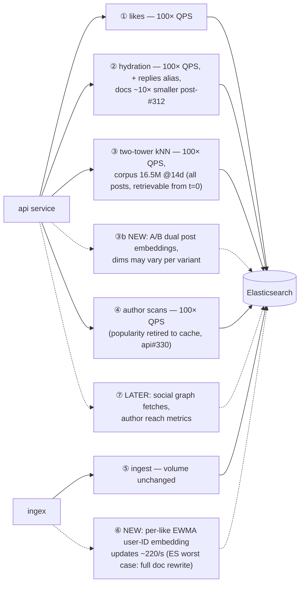

# Feeds Serving Datastore Redesign

**Status:** Draft for review · 2026-07-29
**Scope:** Candidate generation and hydration datastores for feed serving. Ingest volume, ranking models, and ES's role as source of truth are unchanged.

---

## 1. Summary

Feed serving cost on our Elasticsearch cluster is dominated by page-cache residency — the same query runs 26ms warm and 30s cold — and our single worst query (two-tower kNN) is structurally hostile to ES: its filters force Lucene out of the HNSW graph into brute-force vector scans. Capacity work (api#312) buys headroom, but the workload analysis below shows the serving path has outgrown a single search cluster, and roadmap features (per-like embedding updates, A/B post embeddings, 100× user scale) make that gap permanent.

**Proposal:** move two-tower kNN into a vector-capable cache layer (Memorystore for Redis, prototype-first), add roadmap embedding stores (user-ID, author-ID) on the same layer — with a hydration cache held as a trigger-conditioned option (§5.1) — and let ES do what it's good at — source of truth, routed lookups, author scans, hydration. ingex is unchanged until a conditional Phase 3. Each phase ships independently, is gated by PostHog flags with shadow-mode validation, and degrades back to today's ES paths on failure.

| Phase | Ships | Measurable outcome |
|---|---|---|
| **1** | two-tower kNN off ES → Memorystore vector search | Eliminates the dominant ES query; two_tower p95 off the timeout ceiling |
| **2** | Roadmap embedding stores on same layer: user-ID + author-ID embeddings | Unblocks user-ID embedding roadmap; hydration cache kept one flag away (§5.1) |
| **3** *(conditional)* | Pub/Sub streaming from ingex | Only if sub-minute freshness or per-like updates become requirements |

---

## 2. Workload characterization

Five distinct workloads share one ES cluster today. Numbers are measured on prod (2026-07-28/29; marked *provisional* where the post-#312 recovery or 100×-scale load tests will refresh them). Diagrams: [Appendix A](#appendix-a-workload-diagrams).

| # | Workload | Shape | Today (measured) | Future delta | ES fit |
|---|---|---|---|---|---|
| 1 | User's likes | Point lookup (routed terms, ≤50) | ~0.1 QPS, ms-fast when cache-resident | 100× QPS; social-graph fetches later | Fine |
| 2 | Hydration by `at_uri` | KV multi-get (posts; embeddings + features) | ~20KB/doc reads, random over ~4.5TB; `_source` is 65% of posts index | 100× QPS; + replies alias; per-doc reads shrink ~10× when #312 `_source` fix phases in (~2 weeks via ILM) | Poor → OK |
| 3 | Two-tower kNN | Vector ANN, 128d | 109 runs/hr; corpus 773k @14d filtered / **16.5M @14d unfiltered**; `like_count` filter forces brute-force scan; p95 pinned at timeout under cache pressure | 100× QPS; A/B dual embeddings; post_similarity retired in two-tower's favor | **Structurally bad** |
| 4 | Windowed scans / top-N | function_score + author terms | popularity was #321's regression source (p50 350→855ms on window change); author scans routed, OK | popularity → cached (api#330); author scans stay | Mixed |
| 5 | High-frequency partial updates | Per-doc field updates | Only `like_count` increments today | **Per-like EWMA user-ID embedding updates (~220/s)**; author reach metrics | **Worst case** (full doc rewrite per update) |

Two conclusions drive the design: workload 3 needs a store where filters and vectors cooperate, and workload 5 needs a store where updates are cheap. Neither is ES; both are the same store.

---

## 3. Design goals

1. **Iterative and nimble** — every phase is independently shippable and independently valuable; no phase depends on a later one.
2. **Latency over recall** for candidate generation — candidates feed a ranker; a recall miss swaps in a near-equivalent neighbor, while latency is user-visible.
3. **Every post retrievable from t=0** — corpus membership must not exclude new or low-traction content; traction preference is applied by adjustable mechanisms, not hard walls.
4. **Parametric on scale** — 100× users with diverse consumption history; flat ingest volume. Resource claims are provisional until load tests complete.
5. **Minimize new operational surface** — prefer managed services; ingex untouched until Phase 3.
6. **Fail toward ES, not toward nothing** — every new component degrades to today's known-working path.

---

## 4. Key decisions

### 4.1 Corpus membership: all posts in window (drop `like_count>=20` from membership)

| | Keep filter as membership | **All posts in window (chosen)** |
|---|---|---|
| Corpus @14d | 773k vectors (396MB) | 16.5M vectors (8.4GB fp32 / ~2.1GB int8) |
| Membership | Dynamic — post enters on its 20th like; requires re-scans or threshold events | **Static** — enters at creation, leaves at TTL; trivially correct |
| Ingest contract | The hardest part of the design | Upsert once per post |
| Product flexibility | New/low-traction posts unretrievable, period | New-post boosts, unknown-author exploration, explore/exploit all possible |

The traction preference itself is **preserved, as a swappable mechanism** rather than a membership rule — any of:

- **(a) Query-time filtering** — filterable kNN where the store supports it, overfetch+filter otherwise. Near-parity with today's behavior on day one;
- **(b) Ranking-pass shaping** — score adjustment in the heavy ranker;
- **(c) Two-tower modeling** — traction as a model feature, learned rather than imposed.

The choice among (a)/(b)/(c) is deliberately deferred; (a) is the launch default because it requires no model changes, with (b)/(c) as later refinements.

### 4.2 Algorithm: HNSW + scalar quantization, tuned for latency

Our requirements: **native streaming inserts** (no periodic retrain), **p99 ≲10ms** at 16.5M×128d, **RAM-resident** after quantization, **recall ≥0.9**, **TTL-compatible deletes**.

| Algorithm | Mechanics | Meets requirements? | Verdict for us |
|---|---|---|---|
| Flat (brute force) | SIMD dot-product against every vector; no index structure | ✗ — ~200–500ms @16.5M | Exact and simplest at small scale (~10–30ms @773k); only viable for the filtered corpus (kept alive only via option B, §4.3) |
| IVF | k-means partitions; query probes nearest cells | ✗ — periodic retrain conflicts with streaming inserts | Recall drifts under churn |
| **HNSW (chosen)** | Multi-layer proximity graph; greedy coarse→fine descent, O(log n) | **✓** — inserts native (insert = search + link), ~1–5ms, 0.95–0.99 recall | The industry default |
| Filterable HNSW (Qdrant) | Extra payload-aware edges keep the graph connected under filters | **✓** — HNSW plus stronger filtering | Best-in-class filtered ANN; relevant to option C |
| **SQ int8/fp16 (chosen, stacked)** | Scalar-quantize each dimension | **✓** — companion to HNSW, not a standalone index | 2–4× memory reduction at ≈zero recall cost |
| PQ | Subvector codebooks; distance via lookup tables | ✗ — recall cost + rerank complexity solve a ≥100M-vector problem we don't have | 8–32× smaller |
| Binary / RaBitQ | 1 bit/dim + exact rerank of a shortlist | ✓ — but unnecessary at 16.5M | Modern favorite at large scale (ES "BBQ", Qdrant BQ) |
| ScaNN | Anisotropic quantization optimized for inner-product ranking | ✗ — codebook training conflicts with streaming inserts; tuning surface we don't need | Best CPU benchmarks; powers Vertex AI |
| DiskANN / Vamana | Flat graph traversed from SSD | ✗ — solves a RAM constraint we don't have; slow inserts | For corpora that can't fit memory |

Tuning bias: modest `ef_search`, recall target ~0.9–0.95 (per design goal 2). Known caveat: HNSW deletes are tombstoned and reclaimed by vacuum/rebuild; our deletes are pure TTL at the window edge, and the chosen store (§4.3) handles expiry natively.

### 4.3 Index home: Memorystore prototype-first; Qdrant as escalation; in-process struck down

| | **(A) Memorystore Redis vector search (chosen)** | (B) In-process in inference-service | (C) Qdrant (self-hosted) |
|---|---|---|---|
| ANN | HNSW; tag/numeric hybrid filters — adequate for `video_only` + window (+ traction via 4.1a) | Flat exact over filtered corpus | Filterable HNSW + named vectors — best-in-class |
| Window expiry | **Native key TTL** — index follows `EXPIRE` | Own rebuild machinery | Cron delete-by-filter + vacuum |
| KV consolidation | **Same store serves Phase 2 KV** (user/author-ID embeddings, api#330 pools, §5.1 hydration cache if triggered) | None | Payload retrieve-by-ID covers hydration; list/set/counter shapes still want a Redis |
| A/B embeddings | Separate vector fields/indexes | Two arrays | Named vectors per point (elegant) |
| Ops | Managed; low enablement complexity | None new, but per-instance memory duplication at 100× | New self-hosted stateful service |
| Production precedent | GCP-managed RediSearch | Meta (FAISS), Spotify (Voyager) for this class | X (Twitter) recommendation stack |

**(A)** is the proposal: it collapses the ANN home and the Phase 2 KV into one managed layer, Memorystore enablement is low-complexity, and native TTL is the cleanest expiry answer of the three. Gated by the bake-off spike (§6).

**(B)** is retained here because its merits are real: full feature parity with today's known-working query patterns and the fastest possible prototype (no services to enable). It is **struck down as the proposal** because it is probably throwaway work post-launch — wrong for feature flexibility (A/B, filters, per-like updates) and for cost at 100× (index duplicated per autoscaled instance).

**(C)** is the documented escalation with crisp triggers: Redis filter expressiveness proves inadequate (e.g., traction filtering needs filter-aware graph links), named vectors become load-bearing for A/B, or index scale/latency limits are hit. X's production use makes this a de-risked fallback, at the cost of operating a stateful service (plus likely retaining a small Redis for list/set-shaped data anyway).

### 4.4 Freshness and the ingest contract: pull, don't push (until Phase 3)

Corpus membership being static (§4.1) makes the contract almost disappear: a builder pulls new posts from ES on an interval (`fields` API: `at_uri`, `ge_post_embedding` per variant, `created_at`, `contains_video`, `like_count`), upserts with TTL, done. New-post retrievability latency equals the pull interval (target 5–10 min). No ingex changes, no new schema, ES remains the single interface — it is already the materialized view of the firehose.

**Phase 3 (Pub/Sub streaming) has explicit triggers, not a date:** per-like EWMA user-ID-embedding updates go live; a product need for sub-minute retrievability; or builder pulls measurably burden ES. The contract, when needed: versioned protobuf `{op, at_uri, embeddings, features, ts}`, at-least-once with idempotent upserts, tombstones, GCS snapshot + replay on boot.

---

## 5. Architecture by phase

**Serving path — one your-feed load (end of Phase 2; phase annotations inline):**

```mermaid
sequenceDiagram
    participant BSKY as Bluesky AppView
    participant API as api
    participant KV as Memorystore (P2)
    participant INF as inference-service
    participant ANN as Memorystore vector index (P1)
    participant ES as Elasticsearch

    BSKY->>API: getFeedSkeleton
    API->>ES: user's likes (routed, ≤50) — unchanged
    API->>ES: liked-post features + embeddings — unchanged
    API->>KV: user-ID + author-ID embeddings (P2)
    API->>INF: user embedding
    INF-->>API: user embedding
    API->>ANN: kNN(user_emb, k + overfetch, window/video filters)
    ANN-->>API: [(at_uri, score)]
    API->>ES: hydrate candidates (terms by at_uri)
    Note over API,ES: §5.1 trigger-conditioned: cache-aside Memorystore tier in front of<br/>both hydration reads; enables one consolidated per-document fetch<br/>serving candidates AND the downstream MMR/ranker refetch
    API->>API: dedup → diversify → rank → render
```

**Background processes keeping stores fresh:**



(ANN index and KV are one Memorystore instance under option A; drawn separately to show they fail independently.)

### Phase details

| | Phase 1 — kNN off ES | Phase 2 — roadmap embedding stores | Phase 3 — streaming (conditional) |
|---|---|---|---|
| Ships | Vector index + builder; two_tower queries Memorystore | user-ID + author-ID embedding stores, batch-refreshed from ES | Pub/Sub producer in ingex; consumer replaces interval pulls |
| Why now | Removes ES's dominant query; unblocks #324 (window cap removal) | Sole viable store for the data ES handles worst (per-like updates); timed by the embedding roadmap | Only on §4.4 triggers |
| Synergies | — | Natural home for api#330 popularity pools (design deferred to that issue; nothing here depends on its choice); hydration cache slots in here if §5.1 triggers fire | Enables per-like EWMA updates |
| Rollout | PostHog flag; shadow mode logging overlap@k + latency vs ES kNN; per-generator flip | PostHog flag; read-path comparison against direct ES | Dual-write validation window |

### 5.1 Trigger-conditioned add-on: hydration cache

Hydration stays on ES by default. Post-#312 it is ~1–2KB point lookups by `at_uri` — squarely ES's strength — and a cache would add a staleness semantic to `like_count`, a hydrated field the ranker consumes. A cache-aside hydration tier on the already-running Memorystore instance is therefore designed but not built: one flag away, activated by any of:

1. **Load tests** show hydration p95 over budget at 100× (diverse consumption histories are exactly the page-cache-hostile access pattern);
2. **Launch timing** — #312's `_source` gains have not phased in by launch (ILM ageout ≈ 2 weeks, no forced migration);
3. **Measured read amplification** once replies hydration and per-candidate embedding reads land.

If activated, it also enables the consolidated per-document hydration noted in the serving diagram: one fetch serves candidate hydration and the downstream MMR/ranker refetch (today: two call-level-cached fetches with disjoint cache keys).

### Failure behavior

| Failure | Behavior |
|---|---|
| Builder can't reach ES | Serve last-good index (stale candidates are invisible degradation); alert at >30 min stale |
| Memorystore vector index down | ES kNN path retained behind the flag as emergency fallback |
| Memorystore KV down / miss | Embedding reads degrade gracefully (models tolerate the missing feature); hydration cache, if §5.1-enabled, falls through to ES — never no data |
| ES down | Same blast radius as today; no new failure mode introduced |

---

## 6. Validation plan and open questions

1. **Bake-off spike (A vs C):** load the real 16.5M×128d corpus into Memorystore vector search and Qdrant (both a container pull); measure p50/p99 at target QPS, recall@100 vs exact ground truth, memory, insert throughput, TTL/expiry behavior, and filter expressiveness for the §4.1(a) traction filter. This produces the doc's final empirical numbers and settles §4.3.
2. **100× load tests** (in progress, owned separately): may re-rank §4.3 or re-scope ES capacity assumptions; workload table numbers refresh after.
3. **Post-recovery measurement pass:** re-baseline generator latencies post-#312; corpus counts; liked-post age distribution (informs the §5.1 hydration-cache trigger: hot-window size and predicted hit rate); builder pull timing.
4. **Shadow-mode criteria before flag flip:** overlap@k against ES kNN consistent with the recall target; two_tower p95 within budget at shadow QPS; zero increase in degraded renders.

**Open questions:** final traction mechanism (§4.1 a/b/c beyond the launch default); whether any §5.1 hydration-cache trigger fires (load tests, #312 phase-in timing vs launch); whether load tests keep ES viable for workload-4 author scans at 100× or move them onto the roadmap.

---

## Appendix A — Workload diagrams

**A1. Current: five workloads, one cluster.**



**A2. Future workload pattern (deltas dashed; scale notes inline).**



A2 drawn against ES to show what the cluster would absorb *without* this proposal; the design moves ③/③b/⑥ onto Memorystore, and ②'s cache tier is trigger-conditioned (§5.1).

## Appendix B — Market scan (what comparable systems run)

- **X (Twitter):** Qdrant in the recommendation stack — the strongest precedent for option C at social-media scale.
- **Meta:** embedding retrieval served from precomputed FAISS indices inside the search backend.
- **Pinterest:** in-house distributed ANN behind two-tower retrieval (now alongside generative retrieval, PinRec).
- **Spotify:** Voyager — an in-process HNSW library — replacing Annoy; evidence that embedded libraries, not vector-DB servers, are the norm for this workload class at the small end.
- **Pattern:** nobody at our workload shape runs a standalone vector database *cluster*; the choice is between embedded indices and a vector-capable cache/store already in the stack. Standalone vector DBs (Pinecone/Milvus/Weaviate) target RAG products.

## Appendix C — Measurement methodology

- Corpus counts: `_count` with `created_at`/`like_count` filters against `posts_recent` (2026-07-29).
- Query rates & latencies: Cloud Monitoring PromQL over `custom.googleapis.com/greenearth-api/*` metrics, `namespace="prod"`.
- Storage anatomy: `_disk_usage?run_expensive_tasks=true` on `posts-2026-w31`; `_cat/indices`, `_cat/nodes`, `_nodes/stats`.
- Warm/cold spread and brute-force scan evidence: api#310 investigation (query replay with `profile:true`).
- Memory/GC: `_nodes/stats` JVM and OS sections (2026-07-28, pre-recovery — refresh pending).
- Sources: [Qdrant filterable HNSW](https://qdrant.tech/course/essentials/day-2/filterable-hnsw/) · [Qdrant customers](https://qdrant.tech/customers/) · [X/Qdrant](https://www.linkedin.com/posts/stefanweber1_x-twitter-is-now-powered-by-qdrant-vector-activity-7126255589713739776-Ncsx) · [Memorystore vector search](https://docs.cloud.google.com/memorystore/docs/redis/about-vector-search) · [Meta/FAISS](https://engineering.fb.com/2026/04/21/ml-applications/modernizing-the-facebook-groups-search-to-unlock-the-power-of-community-knowledge/) · [Pinterest learned retrieval](https://medium.com/pinterest-engineering/establishing-a-large-scale-learned-retrieval-system-at-pinterest-eb0eaf7b92c5) · [Voyager](https://zilliz.com/learn/what-is-voyager) · [HNSW vs IVF](https://bigdataboutique.com/blog/hnsw-vs-ivfflat-how-to-choose-the-right-vector-index) · [Big ANN benchmarks](https://arxiv.org/pdf/2409.17424)
